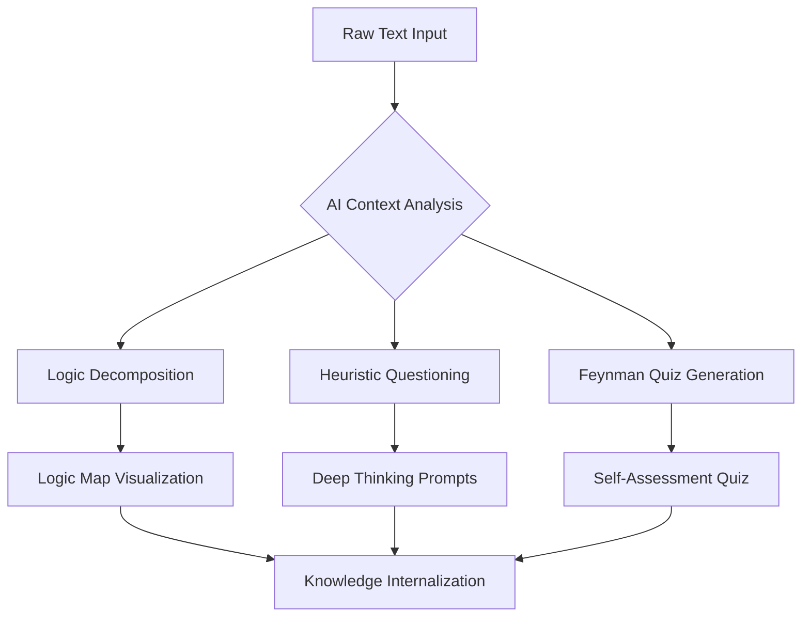

# DeepInsight Learning Agent 🚀

An AI-powered academic assistant built with React, TypeScript, and Google Gemini. It helps users truly understand complex content through logical breakdown, heuristic questioning, and Feynman testing.

## ✨ Key Features

-   **🧠 Logic Decomposition**: Automatically identifies core arguments and evidentiary structures in complex texts.
-   **❓ Heuristic Questioning**: Generates deep-thinking questions using Chain-of-Thought (CoT) to stimulate critical analysis.
-   **🧩 Knowledge Synthesis**: Summarizes content into modular, digestible insights.
-   **🎓 Feynman Test Generation**: Creates targeted assessment quizzes to verify true knowledge internalization.
-   **🎨 Modern UI**: Beautifully crafted interface with smooth animations and responsive design.

## 🧠 Agent Architecture & Workflow

The DeepInsight Learning Agent follows a structured multi-stage reasoning process to ensure deep internalization of knowledge.



## 🖥️ Terminal Execution Example

When running the ingestion process, the agent provides detailed feedback on its reasoning steps:

```text
🚀 [AGENT START] Initiating Deep-Learning Workflow...
📊 [INPUT] Document received. Length: 5420 characters.
🔍 [PROCESS] Step 1: Analyzing document structure and semantic clusters...
   ↳ [Thought] Scanning for key concepts and logical transitions...
✅ [SUCCESS] Semantic structure parsed.
🧠 [PROCESS] Step 2: Generating high-order reasoning questions...
   ↳ [Thought] Identifying logical gaps in the text...
✅ [SUCCESS] 2 deep-thinking questions generated.
🌐 [PROCESS] Step 3: Executing web-based knowledge retrieval...
   ↳ [Tool Call] Searching: 'How does non-locality challenge the principle of local realism?'
   ↳ [Status] Connecting to DuckDuckGo Search API...
✅ [SUCCESS] External knowledge integrated into context.
📝 [PROCESS] Step 4: Synthesizing Feynman-style learning package...
   ↳ [Thought] Mapping extracted knowledge to pedagogical patterns...
✅ [SUCCESS] Learning package finalized.
🌈 [WORKFLOW COMPLETE] All tasks finished successfully.
```

## 🛠️ Tech Stack

-   **Frontend**: React 19, TypeScript, Vite
-   **Styling**: Tailwind CSS
-   **Animation**: Motion (formerly Framer Motion)
-   **AI Engine**: Google Gemini API
-   **Icons**: Lucide React

## 🚀 Getting Started

### 1. Prerequisites

-   Node.js 18+
-   A Google Gemini API Key

### 2. Installation

```bash
# Clone the repository
git clone https://github.com/yourusername/deepinsight-learning-agent.git

# Navigate to project directory
cd deepinsight-learning-agent

# Install dependencies
npm install
```

### 3. Configuration

Create a `.env` file in the root directory (never commit this to GitHub):

```env
VITE_GEMINI_API_KEY=your_gemini_api_key_here
```

### 4. Run the App

```bash
npm run dev
```

## 📄 License

Distributed under the Apache-2.0 License. See `LICENSE` for more information.

---

**Built with ❤️ for lifelong learners.**
